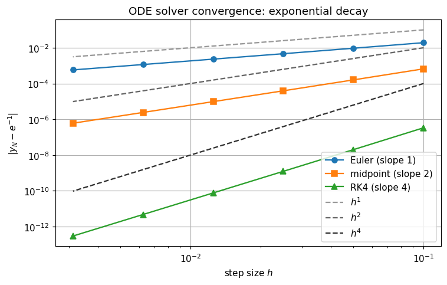

# numethods

A small numerical methods library implementing the classical algorithms from
**MATH 240 (Computational Mathematics)** at Lake Forest College, with full
test coverage, convergence benchmarks, and worked examples.

The package covers Taylor expansion, root-finding, finite differences,
quadrature, ODE solvers, direct and iterative linear solvers, unconstrained
optimization, and linear regression—every routine implemented from
scratch on top of NumPy, validated against SciPy / scikit-learn, and
benchmarked to confirm the textbook convergence rates.

## Quick start

```bash
git clone https://github.com/it-malek/compmath.git
cd compmath
pip install -e ".[dev]"
```

```python
from numethods import newton, rk4, simpson

# Solve x^2 - 2 = 0 with Newton's method
root = newton(lambda x: x**2 - 2, x0=1.0, fprime=lambda x: 2*x)
print(root.root)        # 1.4142135623730951
print(root.iterations)  # 5
print(root.converged)   # True

# Integrate sin(x) from 0 to pi via composite Simpson
import numpy as np
val = simpson(np.sin, 0.0, np.pi, n=20).value
print(val)              # ≈ 2.0000

# Solve dy/dt = -y, y(0)=1 with RK4
sol = rk4(lambda t, y: -y, t_span=(0.0, 1.0), y0=1.0, n_steps=50)
print(sol.y[-1])        # ≈ exp(-1) = 0.3679
```

## What's included

| Module                       | Methods |
|------------------------------|---------|
| `numethods.taylor`           | `taylor_polynomial`, `taylor_remainder_bound` |
| `numethods.rootfinding`      | `bisection`, `newton`, `secant`, `fixed_point` |
| `numethods.differentiation`  | `forward_diff`, `backward_diff`, `central_diff`, `richardson_extrapolation`, `numerical_jacobian` |
| `numethods.integration`      | `trapezoid`, `simpson`, `romberg`, `monte_carlo`, `adaptive_simpson` |
| `numethods.ode`              | `euler`, `midpoint`, `rk4`, `rk45_adaptive` |
| `numethods.linsys`           | `lu_decomposition`, `lu_solve`, `gauss_elimination`, `jacobi`, `gauss_seidel`, `sor`, `conjugate_gradient` |
| `numethods.optimization`     | `gradient_descent`, `gradient_descent_backtracking`, `newton_minimize` |
| `numethods.regression`       | `OLSRegression`, `RidgeRegression`, `polynomial_features` |

Every iterative method returns a structured result (`RootResult`,
`OptimizationResult`, `IterativeSolveResult`, ...) that includes the full
convergence history, so you can plot it, inspect failed runs, or use it
in tests.

## Examples

The `examples/` folder contains the original lab notebooks, cleaned up
and rewritten on top of the library. Each runs top-to-bottom with no
errors and ends with a polished plot.

| Notebook | Topic |
|----------|-------|
| `examples/00_recap_numpy_sympy.ipynb`              | NumPy / SymPy / Matplotlib refresher |
| `examples/01_taylor_polynomials.ipynb`             | Taylor expansion and Lagrange remainder |
| `examples/02_rootfinding.ipynb`                    | Bisection, Newton, secant on $\sqrt{2}$ and $\cos x = x$ |
| `examples/03_integration_and_differentiation.ipynb`| Quadrature, finite differences, $\pi$ via half-disc area |
| `examples/04_odes_and_dynamical_systems.ipynb`     | Damped oscillator, Lotka–Volterra, SIR sweep on $R_0$ |
| `examples/05_linear_systems.ipynb`                 | LU vs Jacobi vs Gauss–Seidel vs CG |
| `examples/06_optimization.ipynb`                   | Gradient descent and Newton on Rosenbrock |
| `examples/07_regression.ipynb`                     | OLS and ridge with polynomial features |

## Benchmarks

Two notebooks under `benchmarks/`:

- **`convergence_rates.ipynb`** – log-log plots showing each method's
  empirical convergence order matches theory ($\mathcal{O}(h)$, $\mathcal{O}(h^2)$, $\mathcal{O}(h^4)$,
  quadratic for Newton).
- **`runtime_vs_scipy.ipynb`** – head-to-head timing against SciPy on the
  same inputs. SciPy wins on speed (it's compiled), but the gap on small
  problems is modest.

Sample plot from the convergence notebook (ODE solvers, exponential decay):



The slopes of 1, 2, and 4 visible above match the theoretical orders of
the Euler, midpoint, and RK4 schemes exactly.

## Testing

```bash
pytest                           # 118 tests, ≈2 seconds
pytest --cov=numethods           # 92% line coverage
ruff check numethods tests       # style / lints
```

## Method reference

See [`docs/method_reference.md`](docs/method_reference.md) for a one-page
"I want to do X, which method should I use?" cheat sheet.

## Course attribution

The original lab assignments come from MATH 240 (Introduction to
Computational Mathematics) at Lake Forest College. The library and
infrastructure here are an expanded, productionized version of that work.

## License

MIT – see [LICENSE](LICENSE).
